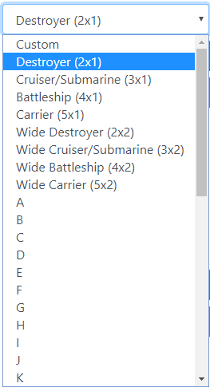
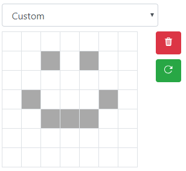
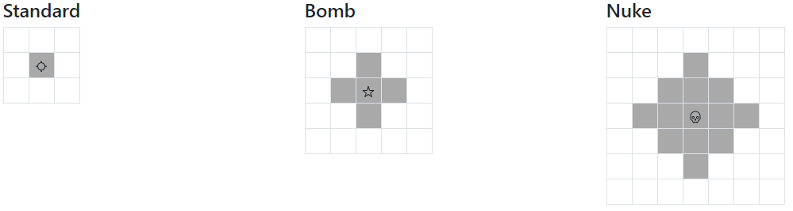
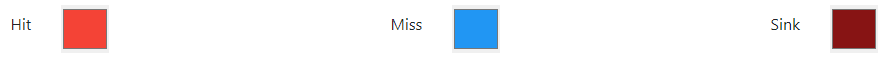
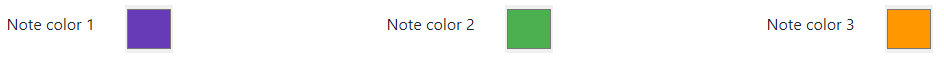
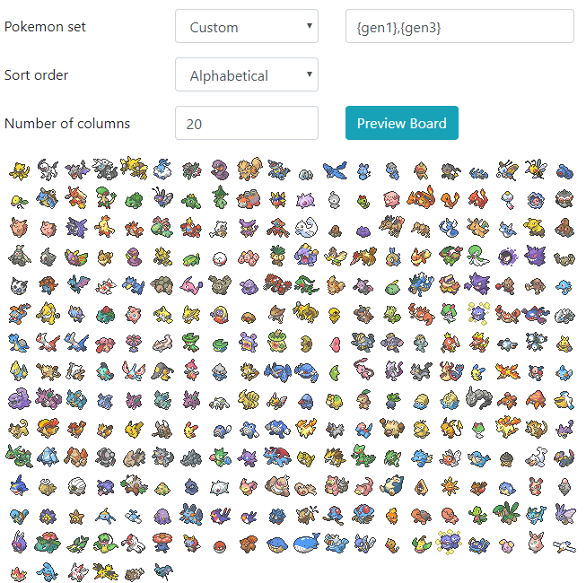
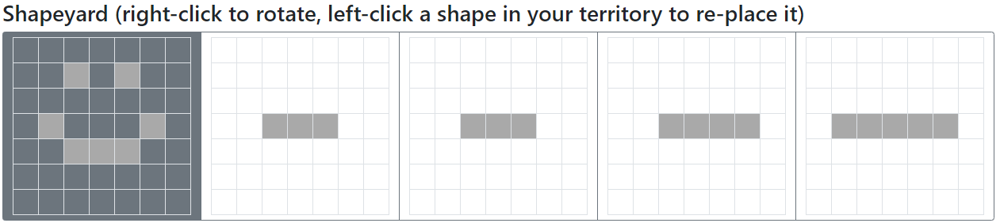
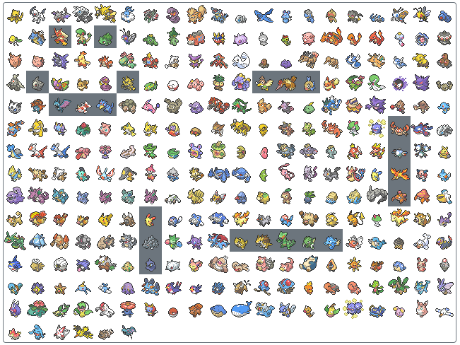
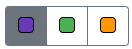
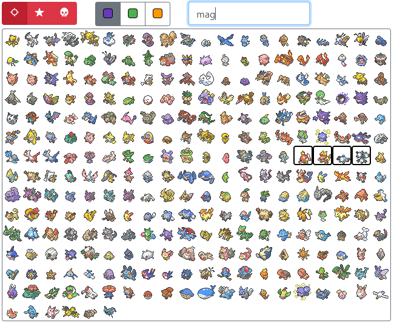

# Battleshapes

An attempt at an improvement on existing Pokemon battleship/yeecht yacht solutions. The application is hosted [here](https://connormuench.github.io/battleshapes/).

## Game Setup

### Shapes

Any number of shapes (greater than 0) can be specified.

Presets are included for many different shapes (ships). These include standard Battleship shapes, letters, numbers, symbols, and Tetris pieces.

Custom shapes are also possible:

The green button attached to each shape controls whether the shape can be rotated when placing it on the grid.

### Shots

Three types of shots are available: standard, bomb, and nuke. All three are fully customizable within their corresponding bounding boxes.

### Colours

Colours can be customized for actions and notes. Actions include hits, misses, and sinks, and notes are useful for marking target tiles or tiles that are eliminated.

### Timer

A standard, counting-up speedrun-style timer is included by default. A five-second countdown is provided once both players have selected their ships and readyed up.

A timer is available for reminders of periodic events. If you'd like the first reminder to be at 1:30:00.0, and each successive reminder to be 10 minutes after, use 90 for the start time, and 10 for the interval. Decimal values are not allowed.

### Board Layout

Many presets are included for Pokemon sets, and should cover most use cases. However, if the presets are not granular enough, a box is available for full customization. `{gen#}` macros are available for convenience, to create complex sets like `1,4,7,147-151,{gen3}`.

Multiple sort orders are possible as well, like alphabetical, numerical, Pokerap, and Scrabble. This will sort the provided Pokemon set by the provided option.

The number of columns in the grid is an additional option that adjusts the game board's width.

### Configuration persistence

Buttons are available for saving and loading configurations, so if you use a certain configuration frequently, you can save it and load it instantly when creating future games.

## Gameplay

### Connection Setup

The application walks you through the connection steps. The protocol used is WebRTC, a reliable, fast, peer-to-peer connection protocol. This is the same protocol as used in felixnemis's PokedexLockout.

### Placing Shapes

All shapes defined in the game setup will show in the shapeyard. Right-clicking on a shape will rotate it 90 degrees clockwise, and left-clicking a shape will make it active to place on your grid.

Right-clicking on your grid before placing a shape will also rotate the shape. Left-clicking will place the shape. If you've made a mistake, you can left-click a shape in your territory to place it back in the shapeyard.

### Attacking

Once the timer begins counting up, your opponent's territory becomes usable. A left-click will fire the current shot selected in the shot selection toggle:

Similarly, a right-click will annotate a tile according to the selected note colour in the note toggle:

### Search

For some sort orders, finding Pokemon in the grid can be tough, so a search box is available to help with this. As text is typed in the box, Pokemon matching the query will be outlined. Pokemon numbers are also acceptable queries.

